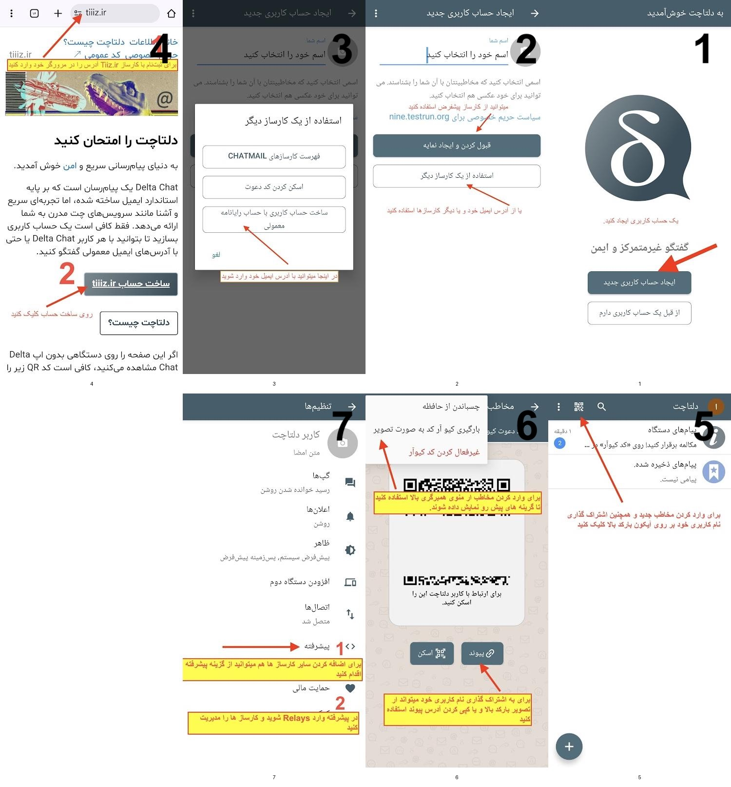

 #راهنمای اینترنت آزاد: چگونه در زمان قطعی اینترنت، همچنان با دیگران در ارتباط بمانیم؟

---

# مقدمه: چرا این راهنما مهم است؟

ارتباط با سایرین بخش مهمی از زندگی ماست، و اینترنت نقش پررنگی در آن دارد، اما گاهی دسترسی به آن محدود یا قطع می‌شود. برای حل این مشکل، راه‌کارها و شبکه‌های غیرمتمرکزی وجود دارند که توسط **هیچ نهاد واحدی** کنترل نمی‌شوند و امکان ارتباط امن حتی در شرایط سخت را فراهم می‌کنند.

---

# بخش اول: پیام‌رسان‌های امن برای چت خصوصی و گروهی

وقتی واتس‌اپ و تلگرام از دسترس خارج می‌شوند، این ابزارها بهترین جایگزین برای ارتباطات امن و رمزنگاری‌شده هستند که در ادامه به معرفی و راهنمای استفاده از آنها می پردازیم.

## 1\. پروتکل ماتریکس (Matrix) با اپلیکیشن اِلِمِنت (Element)

ماتریکس یک پروتکل ارتباطی است و اِلِمِنت (Element) اپلیکیشنی برای استفاده از آن است. آن را یک نسخه غیرمتمرکز و بسیار امن‌تر از تلگرام یا واتس‌اپ در نظر بگیرید.

چگونه از Element استفاده کنیم:

1.اپلیکیشن Element یا Element X را دانلود کنید: از [گوگل پلی](https://play.google.com/store/apps/details?id=io.element.android.x) یا [F-Droid](https://f-droid.org/en/packages/io.element.android.x/) برای اندروید، وبرای ios از [اپ استور](https://apps.apple.com/app/id1631335820) یا سایت رسمی (https://element.io) آن.
 
2. یک "Homeserver" انتخاب کنید: این مهم‌ترین مرحله است. Homeserver پایگاه اصلی حساب شماست.   
   **توصیه مهم**: از سرور پیش‌فرض matrix.org یا سرورهای عمومی معتبر دیگر استفاده کنید. ( میتوانید از سرور [Wiiz.ir](http://Wiiz.ir) استفاده کنید). و از ساخت حساب روی سرورهای ناشناس خودداری کنید، مگر اینکه مدیر آن را کاملاً بشناسید و اعتماد صددرصدی داشته باشید.  
3. حساب کاربری بسازید: نام کاربری شما شبیه به **YourName:server.com@** خواهد بود.  
   * تایید هویت (Verification): در Element، وقتی با شخص جدیدی چت می‌کنید یا از یک دستگاه جدید وارد می‌شوید، باید هویت خود و طرف مقابل را تایید کنید. به دنبال سپر سبز رنگ بگردید. این کار تضمین می‌کند که پیام‌های شما واقعاً رمزنگاری شده و فرد دیگری در میان نیست.  
4. استفاده از VPN همچنان، در صورت امکان توصیه می‌شود.

**راهنمای تصویری ثبت‌نام و ورود به ماتریکس**

## 2\. دلتاچت (Delta Chat)

هدف دلتاچت تبدیل ایمیل به یک پیام‌رسان امن است\! این اپلیکیشن ظاهری شبیه به بقیه دارد، اما در پشت صحنه، پیام‌های شما را از طریق سرور ایمیل‌تان و رمزنگاری شده ارسال و دریافت می‌کند.

چرا دلتاچت در شرایط ایران فوق‌العاده است؟  
زیرساخت ایمیل یکی از قدیمی‌ترین و پایدارترین بخش‌های اینترنت است. قطع کردن کامل ایمیل بسیار دشوارتر از فیلتر کردن یک اپلیکیشن خاص است. تا وقتی ایمیل کار کند، دلتاچت هم کار می‌کند. 

در دلتاچت میتوانید از کارسازهای(رله) مختلف استفاده و در صورت بسته شده یکی از آن‌ها همچنان متصل بمانید.

چگونه از Delta Chat استفاده کنیم:

1. اپلیکیشن [Delta Chat] را میتوانید از [گوگل پلی](https://play.google.com/store/apps/details?id=chat.delta) یا [F-Droid](https://f-droid.org/app/com.b44t.messenger) برای اندروید، وبرای ios از [اپ استور](https://apps.apple.com/us/app/delta-chat/id1459523234) یا سایت رسمی (https://delta.chat) دانلود کنید.  
2. حساب کاربری بسازید: میتوانید از ایمیل خود با رله‌های عمومی استفاده کنید. (میتوانید از سرور [Tiiiz.ir](http://Tiiiz.ir) استفاده کنید). رله‌های عمومی به آدرس ([https://chatmail.at/relays](https://chatmail.at/relays)) قابل مشاهده هستند.  
   * **توصیه امنیتی:** از ایمیل اصلی یا کاری خود استفاده نکنید. یک حساب ایمیل جدید (مثلاً یک جیمیل جدید) صرفاً برای این کار بسازید.  
3. برای چت با یک نفر، فقط آدرس ایمیل او را لازم دارید.  
   * اگر طرف مقابل شما هم از دلتاچت استفاده کند، چت شما به صورت خودکار رمزنگاری سرتاسری (End-to-End Encrypted) می‌شود و یک علامت قفل کنار پیام‌ها ظاهر می‌شود.  
4. همچنین در صورت قطع شدن کارسازهای عمومی، شما میتوانید از طریق **سرویس‌های ارائه دهنده ایمیل ایرانی** استفاده کنید. پیام‌ها همچنان رمزنگاری میشوند و ارایه‌ دهنده به محتوای پیام‌های شما دسترسی نخواهد داشت.  
5. در صورت امکان، استفاده از VPN همچنان برای مخفی کردن IP شما از سرور ایمیل توصیه می‌شود.

---

**راهنمای تصویری ثبت‌نام و ورود به دلتاچت**

# بخش دوم: ابزارهای ارتباطی آفلاین (Mesh Networks)

این ابزارها برای سناریوی بدترین حالت طراحی شده‌اند: یعنی زمانی که هیچ‌گونه اینترنتی (نه ملی و نه جهانی) در دسترس نیست. آن‌ها از طریق بلوتوث و وای-فای مستقیم (Wi-Fi Direct) یک شبکه محلی بین گوشی‌های نزدیک به هم ایجاد می‌کنند.

## 1.[بریار](https://briarproject.org) (‌Briar)

یک پیام‌رسان نظیر به نظیر (Peer-to-Peer) است که برای فعالان و روزنامه‌نگاران طراحی شده. پیام‌ها فقط روی گوشی شما و مخاطبتان ذخیره می‌شوند. می‌تواند از طریق **بلوتوث**، **وای-فای** یا (در صورت وجود اینترنت) شبکه Tor کار کند.

## 2\. [بریجیفای](https://bridgefy.me/#:~:text=Offline%20Messaging,Google%20Play%20Review) (Bridgefy) 

این اپلیکیشن نیز از **بلوتوث** برای ایجاد یک شبکه مش استفاده می‌کند و به شما اجازه می‌دهد به افرادی که در محدوده بلوتوث شما هستند (تا ۱۰۰ متر) پیام بدهید. همچنین می‌تواند پیام شما را از طریق گوشی‌های دیگران (به صورت پل) به فواصل دورتر برساند.

## 3.[بیت‌چت](https://bitchat.free) (bitchat)

یک پیام‌رسان امن و غیرمتمرکز است که بدون نیاز به اینترنت کار می‌کند. ارتباط بین کاربران از طریق بلوتوث (و شبکه مش) انجام می‌شود و پیام‌ها مستقیماً بین گوشی‌ها ردوبدل می‌شوند. هیچ سرور مرکزی وجود ندارد و اطلاعات فقط روی دستگاه کاربران باقی می‌ماند، به همین دلیل برای شرایط قطع اینترنت و ارتباطات امن محلی مناسب است. این پیامرسان توسط جک دورسی محقق امنیت توسعه داده شده. 

---

# بخش سوم: رمزنگاری آفلاین

1. ## رمزنگاری پیام‌های متنی و SMS (به کمک Nahoft)

«نهفت» نرم‌افزار آفلاین برای رمزنگاری پیام‌های متنی در گوشی‌های اندرویدی و آی او اس است. با نهفت پیام‌های خود را در قالب یک عکس یا رشته‌ای از کلمات معنادار فارسی رمزنگاری کرده و آن را از طریق **هر پیام رسانی**، برای شخص مورد نظر خود ارسال کنید. نهفت یک پیام‌رسان نیست، بلکه ابزاری برای رمزنگاری پیام‌هاست.  

شما میتوانید اپلیکیشن نهفت را از [اپ استور](https://apps.apple.com/tr/app/nahoft/id6464687067) برای ios , و برای اندروید از [گوگل پلی](https://play.google.com/store/apps/details?id=org.nahoft.nahoft) یا سایت رسمی (https://nahoftapp.com) دانلود کنید. همچنین نحوه استفاده از آن هم در سایتش موجود است.

**نکته: به دلیل مشخص بودن گیرنده و فرستنده و مشکوک شدن اپراتور به دلیل رمزنگاری، پیام ها تا جای ممکن از استفاده این نوع رمزنگاری در پیامک‌های خود(SMS) استفاده نکنید\!**

**راهنمای تصویری استفاده از نهفت**(برگرفته از سایت اصلی)  

---

# 

# 

# بخش چهارم : ابزارهای ذخیره‌سازی و مرور آفلاین محتوا

در زمان قطعی اینترنت، دسترسی به اطلاعات به اندازه ارتباطات مهم است.

## 1\. [Kiwix](https://kiwix.org/en/)

این نرم‌افزار به شما اجازه می‌دهد نسخه‌های کاملی از وب‌سایت‌های مرجع مانند ویکی‌پدیا، ویکی‌واژه، کتاب‌های پروژه گوتنبرگ و... را دانلود کرده و به صورت کاملاً آفلاین مرور کنید. داشتن یک نسخه از ویکی‌پدیا روی گوشی در زمان قطعی، یک ثروت است.

## 2\. [مرورگر Ceno](https://ceno.app/en/index.html)

(بسیار کاربردی) این مرورگر بر پایه فایرفاکس ساخته شده و دو کار مهم انجام می‌دهد: ۱) یک ابزار داخلی برای عبور از فیلترینگ دارد. ۲) مهم‌تر از آن، محتوای وبی که شما یا دیگر کاربران Ceno مشاهده کرده‌اند را کش (Cache) کرده و از طریق شبکه نظیر به نظیر (شبیه BitTorrent) با دیگران به اشتراک می‌گذارد. یعنی اگر یک نفر یک صفحه خبری را باز کند، دیگران در آن منطقه می‌توانند آن صفحه را حتی با اینترنت ضعیف یا قطع شده باز کنند.

## 3\. دانلود نقشه‌های آفلاین

اپلیکیشن‌هایی مانند [Organic Maps](https://organicmaps.app) یا [OsmAnd Maps](https://osmand.net) به شما اجازه می‌دهند نقشه‌های کامل شهر یا کشور را دانلود کنید تا در زمان عدم دسترسی به GPS یا اینترنت، مسیر خود را پیدا کنید.

---

# 

# نکات امنیتی و مهم

1. **در صورت امکان، همیشه از VPN معتبر استفاده کنید:** این اولین و مهم‌ترین قدم برای هر فعالیتی در اینترنت است. هر VPN لزوما امن نیست و حتی می تواند امنیت شما را به خطر اندازد.  
2. **به مدیر سرور اعتماد کنید:** در ماتریکس شما به یک سرور اعتماد می‌کنید. سرورهای معتبر، عمومی انتخاب کنید و یا برای سرورهای خصوصی و ایرانی مطمئن شوید مدیر سرور را می شناسید و به آن اعتماد دارید.  
3. **اطلاعات هویتی را هرگز به اشتراک نگذارید:** نام، شماره تلفن، آدرس و هر چیزی که هویت واقعی شما را فاش کند، در این شبکه‌ها به اشتراک نگذارید. و در صورت امکان از هویت واقعی خود استفاده نکنید. و برای هر سرویس، یک حساب کاربری جدا (و ایمیل جدا) بسازید.   
4. **ابزارها را از قبل دانلود و آماده کنید**. تمام اپلیکیشن‌ها را نصب و آزمایش کنید. یک نسخه از فایل نصبی برنامه‌های مهم را به صورت آفلاین ذخیره کنید. فایل‌ها را فقط از منابع معتبر و اصلی دانلود کنید.  
5. یادتان باشد هیچ فردی در فضای آنلاین نمیتواند امن باشد. فقط به افرادی که می‌شناسید اعتماد کامل کنید.  
6. **از امروز آماده شوید\! منتظر روز قطعی اینترنت نمانید.**  
   

**بیاد داشته باشید این ابراز نمی‌توانند برای همیشه متصل و قابل استفاده بمانند. در صورت قطع شبکه ملی ارتباطات، بسیار بعید است ابزار ارتباطی آنلاین همچنان کار کنند. در زمان خاموشی کامل استفاده از رمزنگاری آفلاین محتوای پیام و پیامرسان‌های مبتنی بر مش آخرین سنگر هستند.**

**این راهنما و اطلاعات را برای دیگران بفرستید. هرچه افراد بیشتری آماده باشند، روزهای سخت کمتری پیش رو خواهیم داشت.**
